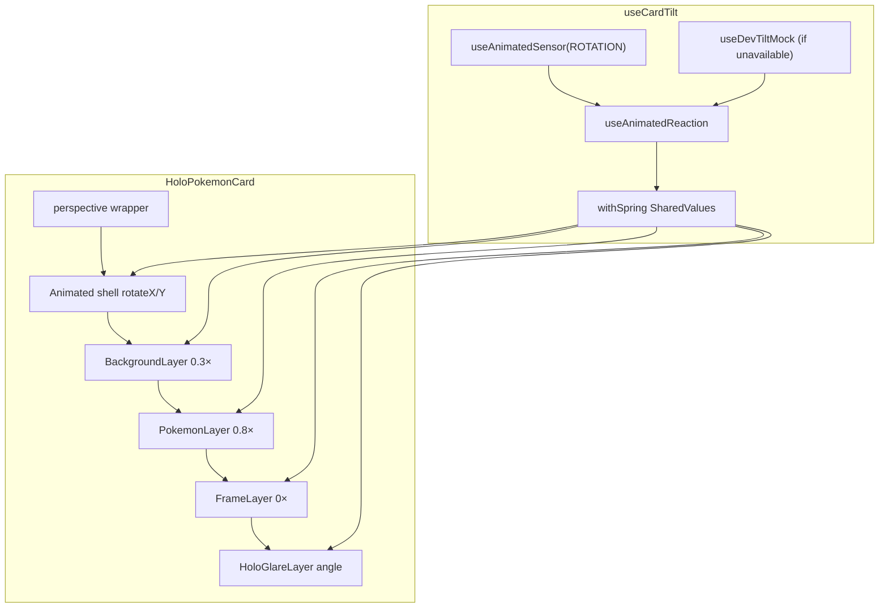
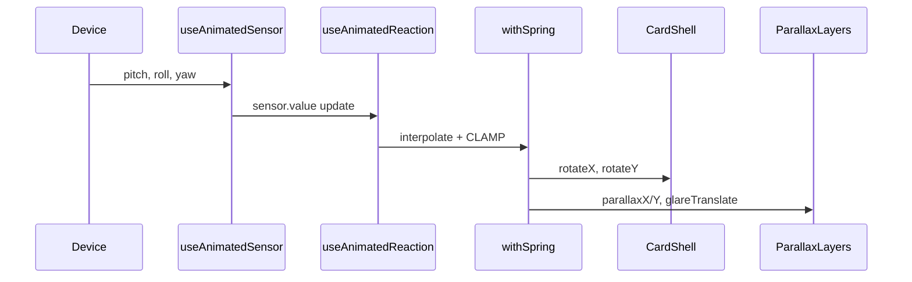

# Holo Card Architecture

## Overview

Motion flows from a single hook (`useCardTilt`) into a 3D-rotated card shell and four absolutely positioned layers. Layers never register sensors themselves.

## SharedValue contract

| Output | Type | Consumer |
|--------|------|----------|
| `rotateX` | degrees | Card shell `rotateX` |
| `rotateY` | degrees | Card shell `rotateY` |
| `parallaxX` | -1..1 | Layer `translateX` × multiplier |
| `parallaxY` | -1..1 | Layer `translateY` × multiplier |
| `glareTranslate` | pixels | Holo band horizontal sweep |
| `glareAngle` | radians | Holo band rotation |

## Layer parallax table

| Layer | Component | Multiplier | Notes |
|-------|-----------|------------|-------|
| 0 | BackgroundLayer | 0.3× | Slowest — feels far |
| 1 | PokemonLayer | 0.8× | Fastest — pops forward |
| 2 | FrameLayer | 0× | Stats stay readable |
| 3 | HoloGlareLayer | 0× translate | Uses angle + sweep |

## Sequence (one sensor frame)

## Constants (`cardLayout.ts`)

All magic numbers live in one file with comments explaining *why*:

- `MAX_ROTATE_DEG = 12` — prevents backface / layout breakage
- `CARD_SPRING_CONFIG` — `{ damping: 15, stiffness: 150 }`
- `PARALLAX_X/Y_RANGE = 18` — max pixel shift at full tilt
- `GLARE_OPACITY = 0.35` — foil intensity (higher on Android fallback)

## Dev ergonomics

When `rotation.isAvailable === false`:

1. Yellow banner: *"Tilt requires a physical device"*
2. In `__DEV__`, `useDevTiltMock` wires a Pan gesture to the same SharedValue pipeline — layers need zero conditional logic.

## Sensor lifecycle

`useAnimatedSensor` registers on mount and unregisters on unmount (tab navigation away cleans up automatically via the hook's `useEffect` cleanup).
