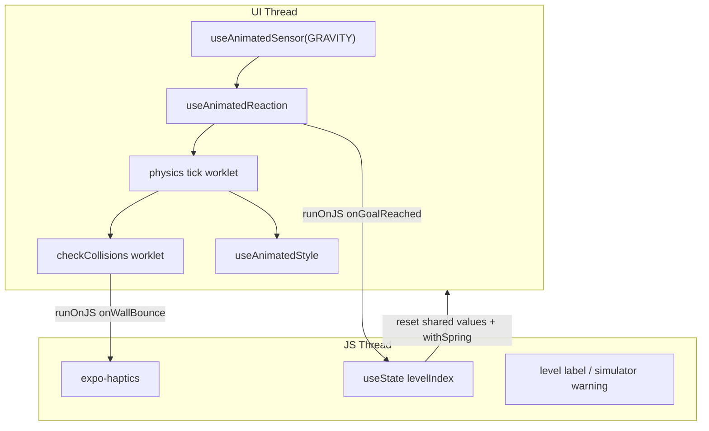

# Marble Labyrinth — Implementation Plan

## Context

This plan targets the existing [`pokemony2`](../) Expo 54 app, not a greenfield project.

| Already in place | Gap |
|---|---|
| Reanimated **4.1.1** + worklets ([`package.json`](../package.json)) | No `useAnimatedSensor` usage yet |
| `GestureHandlerRootView` in [`app/_layout.tsx`](../app/_layout.tsx) | No `expo-haptics` |
| Gesture ball demo in [`app/(tabs)/playground.tsx`](../app/(tabs)/playground.tsx) (300×520 board, AABB bounds) | No maze / collision worklets |
| Expo Router tabs in [`app/(tabs)/_layout.tsx`](../app/(tabs)/_layout.tsx) | New tab needed |

**Version note:** The brief references Reanimated v3; this project uses **v4**. The sensor API is unchanged — `useAnimatedSensor`, `SensorType.GRAVITY`, `runOnJS`, etc. all export from `react-native-reanimated` as in v3.

**User choices:** New tab (keep Ball playground); Phases 1–5 only (stretch goals deferred).

---

## Architecture



**Data flow per sensor frame:**
1. `prepare`: read `sensor.sensor.value` (x, y, z in m/s², orientation-adjusted by default)
2. `react`: apply gravity → friction → integrate velocity → clamp board edges → `checkCollisions(walls, …)` → goal test
3. `useAnimatedStyle`: `translateX(posX - radius)`, `translateY(posY - radius)` on marble + shadow

---

## File layout

Follow existing project conventions (`components/<feature>/`, `app/(tabs)/`), not a new `src/` root:

```
app/(tabs)/marble.tsx                          # thin route → GameScreen
components/marble-labyrinth/
  GameScreen.tsx                               # hooks orchestration, HUD, level state
  components/Marble.tsx                        # Animated.View + shadow + win pulse
  components/MazeRenderer.tsx                  # walls + goal circle (static Views)
  components/SensorDebugOverlay.tsx            # Phase 1 live x/y/z (optional toggle)
  data/levels.ts                               # Level[] — 3+ mazes
  utils/physics.ts                             # constants + checkCollisions worklet
  utils/haptics.ts                             # thin wrappers called via runOnJS
  types/level.ts                               # Wall, Level types
  index.ts
```

Register tab in [`app/(tabs)/_layout.tsx`](../app/(tabs)/_layout.tsx):

```tsx
<Tabs.Screen name="marble" options={{ title: 'Marble' }} />
```

---

## Dependencies

Install one package:

```bash
npx expo install expo-haptics
```

No `expo-sensors` — Reanimated registers native sensors internally. No Babel changes needed (Expo 54 auto-configures the Reanimated plugin, per [`solar-system-plan.md`](solar-system-plan.md)).

---

## Board constants

Reuse the playground board size for consistency with existing demos:

| Constant | Value | Source |
|---|---|---|
| `BOARD_W` | 300 | [`playground.tsx`](../app/(tabs)/playground.tsx) |
| `BOARD_H` | 520 | same |
| `MARBLE_RADIUS` | 14 | half of playground ball (28) for tighter mazes |
| `FRICTION` | 0.985 | brief |
| `SENSITIVITY` | ~0.35 | tune on device; gravity ≈ 9.8 m/s² |
| `WALL_BOUNCE_DAMPING` | 0.6 | match playground `BOUNCE_COEFF` |

Coordinate mapping (from brief):
- `velX += sensor.x * SENSITIVITY`
- `velY -= sensor.y * SENSITIVITY` (RN Y axis flip)

---

## Phase-by-phase implementation

### Phase 1 — Sensor foundation

In `GameScreen.tsx`:

```tsx
const gravity = useAnimatedSensor(SensorType.GRAVITY);
// gravity.sensor.value → { x, y, z, interfaceOrientation }
```

- Render `SensorDebugOverlay` showing live x/y/z via `useAnimatedReaction` + `runOnJS(setDebugValues)` **or** `useDerivedValue` + `Animated.Text` if using Reanimated text (simpler: JS overlay bridged once per frame is fine for a debug label).
- Show a persistent banner when `!gravity.isAvailable` ("Sensors unavailable — use a physical device").
- **Do not write physics yet** — goal is to validate tilt directions before coding collisions.

### Phase 2 — Marble shared state

Four shared values in `GameScreen.tsx`: `posX`, `posY`, `velX`, `velY`.

`Marble.tsx` receives shared values + optional `scale` shared value for win pulse:

```tsx
const marbleStyle = useAnimatedStyle(() => ({
  transform: [
    { translateX: posX.value - MARBLE_RADIUS },
    { translateY: posY.value - MARBLE_RADIUS },
    { scale: scale.value },
  ],
}));
```

Shadow: second `Animated.View`, same transforms with `+3` offset, `opacity: 0.25`, `scale: 0.85`.

### Phase 3 — Physics engine (core)

**[`utils/physics.ts`](../components/marble-labyrinth/utils/physics.ts)** — pure worklets:

```ts
export function checkCollisions(
  walls: Wall[],
  radius: number,
  posX: SharedValue<number>,
  posY: SharedValue<number>,
  velX: SharedValue<number>,
  velY: SharedValue<number>,
  onWallHit?: () => void, // runOnJS wrapper, debounced
): void
```

AABB vs circle algorithm (per brief):
1. Find closest point on wall rect to circle center
2. If distance² < radius² → overlap on axis with smaller penetration
3. Reflect velocity on that axis; push position out by overlap
4. Call `runOnJS(onWallHit)()` with a `lastBounceFrame` shared value debounce (~100ms) to avoid haptic spam

**`useAnimatedReaction` in `GameScreen.tsx`:**

```tsx
const walls = levels[levelIndex].walls; // plain array, worklet-safe

useAnimatedReaction(
  () => gravity.sensor.value,
  () => {
    'worklet';
    if (goalLocked.value) return;

    const { x, y } = gravity.sensor.value;
    velX.value += x * SENSITIVITY;
    velY.value -= y * SENSITIVITY;
    velX.value *= FRICTION;
    velY.value *= FRICTION;

    posX.value += velX.value;
    posY.value += velY.value;

    // board edge clamp + reflect (same pattern as playground bounds)
    clampAndBounce(posX, velX, MARBLE_RADIUS, BOARD_W - MARBLE_RADIUS);
    clampAndBounce(posY, velY, MARBLE_RADIUS, BOARD_H - MARBLE_RADIUS);

    checkCollisions(walls, MARBLE_RADIUS, posX, posY, velX, velY, onWallHit);

    if (isInGoal(posX.value, posY.value, goal)) {
      goalLocked.value = 1;
      runOnJS(onGoalReached)();
    }
  },
  [walls, goal],
);
```

**Worklet safety rules** (comment prominently in `GameScreen.tsx`):
- No React state/refs inside reaction
- `walls` / `goal` are plain objects in the dependency array — reaction re-registers on level change
- All JS callbacks wrapped: `const onGoalReached = useCallback(...);` then `runOnJS(onGoalReached)`

**Goal lock:** `goalLocked` shared value prevents duplicate `runOnJS` while win animation plays.

### Phase 4 — Maze levels

**[`data/levels.ts`](../components/marble-labyrinth/data/levels.ts):**

```ts
export type Wall = { x: number; y: number; w: number; h: number };
export type Level = {
  walls: Wall[];
  start: { x: number; y: number };
  goal: { x: number; y: number; r: number };
};
export const levels: Level[] = [ /* 3 levels */ ];
```

Level design on 300×520 grid:
- **Level 1:** Open L-shaped corridor, wide passages
- **Level 2:** S-curve with 2–3 internal walls
- **Level 3:** Narrow choke points + dead-end branch

`MazeRenderer.tsx`: map `walls` to absolutely-positioned `View`s (`backgroundColor: '#2a2a2a'`), goal as green circle at `goal.x/y` with radius `goal.r`.

**Level reset** (`resetLevel(start)`):
- `velX/velY = 0`
- `goalLocked = 0`
- `posX/posY` via `withSpring(start, { damping: 14, stiffness: 120 })` from off-screen entry point (Phase 5)

React state: `levelIndex`, `levelCount`; HUD shows "Level N / 3".

### Phase 5 — Feedback and polish

| Hook | Usage |
|---|---|
| `withSpring` | Level start: marble drops from above `start.y - 80` into position |
| `withSequence` | Goal: `withSequence(withSpring(1.3), withSpring(1))` on `scale` shared value, then `runOnJS(advanceLevel)` after ~400ms |
| `runOnJS` | `onGoalReached`, `onWallHit`, `advanceLevel` |
| `expo-haptics` | `ImpactFeedbackStyle.Light` on wall; `NotificationFeedbackType.Success` on level complete |

Win flow:
1. Reaction detects goal → `goalLocked = 1`
2. `runOnJS` triggers haptic + starts scale pulse on UI thread
3. After pulse, `runOnJS(advanceLevel)` increments `levelIndex` or shows "You win!"

---

## Hook inventory (teaching checklist)

Each hook gets a `// REANIMATED: <hook>` comment at first use site in `GameScreen.tsx` / `Marble.tsx`:

- `useAnimatedSensor` — gravity input
- `useSharedValue` — pos, vel, scale, goalLocked
- `useAnimatedStyle` — marble + shadow transforms
- `useAnimatedReaction` — physics loop
- `runOnJS` — haptics, level advance, debug overlay
- `withSpring` — level entry
- `withSequence` — goal pulse

---

## Implementation todos

- [ ] Install expo-haptics; add marble tab route + `_layout.tsx` entry
- [ ] Scaffold GameScreen with `useAnimatedSensor` + debug overlay + simulator warning
- [ ] Add Marble component with shared pos values and `useAnimatedStyle` (static marble)
- [ ] Implement `physics.ts` worklets + `useAnimatedReaction` loop with board bounds and collisions
- [ ] Define 3 levels, MazeRenderer, level state + reset on advance
- [ ] `withSpring` entry, `withSequence` goal pulse, haptics via `runOnJS`, shadow layer
- [ ] Test on physical iOS/Android device; tune SENSITIVITY and friction constants

---

## Testing plan (physical device required)

1. `npx expo run:ios` or `run:android` on **real hardware** (simulator shows unavailable banner)
2. Phase 1: flat phone → z ≈ 9.8, x/y ≈ 0; tilt right → x increases
3. Phase 3: marble rolls with gravity, bounces off walls without tunneling at moderate speed
4. Complete all 3 levels; verify haptics fire once per wall hit (debounced) and on goal
5. Confirm Ball tab ([`playground.tsx`](../app/(tabs)/playground.tsx)) still works unchanged

---

## Deferred (Phase 6 — not in v1)

- Sensor type toggle (GRAVITY vs ACCELEROMETER)
- Sensitivity `useSharedValue` + slider
- Tilt angle indicator
- Level timer + best times

These can be added later without restructuring the physics module.
