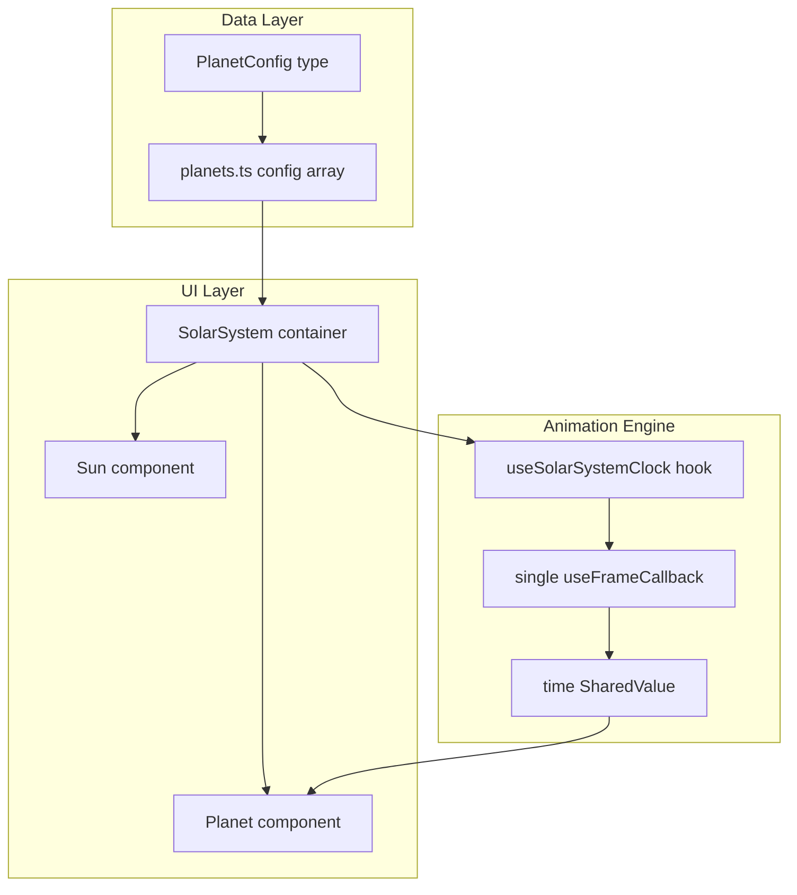
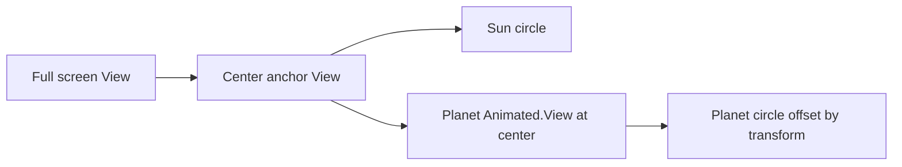

# Solar System Reanimated — Implementation Plan

## Current State

The project is a fresh Expo 54 app with **Reanimated 4.1.1** already working ([`app/index.tsx`](../app/index.tsx) demo uses `useSharedValue`, `useAnimatedStyle`, `withTiming`). [`app/_layout.tsx`](../app/_layout.tsx) already wraps the app in `GestureHandlerRootView`. No new dependencies are needed.

---

## Scope (v1)

**Ship now:** Sun + **one planet** (Earth as the initial seed entry).

**Architecture from day one:** Multi-planet ready — planets live in a config array, `SolarSystem` maps over it, and the global clock is shared. Adding a second planet later is a one-line config change with no engine or component changes.

---

## Architecture Overview



**Data defines what exists → engine drives motion → components render shapes.**

Even with one planet, `SolarSystem` renders via `planets.map(...)` so the data-driven pattern is established immediately.

---

## Technical Decisions (Recommended)

### 1. Orbit animation: single global clock via `useFrameCallback`

Three viable Reanimated approaches:

| Approach | Performance | Notes |
|---|---|---|
| **N × `withRepeat(withTiming)` per planet** | Good for ~3–5 planets | N independent native animators; scales poorly |
| **N × `useFrameCallback` per planet** | Poor | N callbacks firing every frame |
| **1 × `useFrameCallback` + shared `time` value** | **Best** | One callback for the whole system; true rad/s semantics; scales to many planets |

**Recommendation:** Use a **single global clock** — one `useFrameCallback` in `SolarSystem` (via `useSolarSystemClock`) that advances a shared `time` value by delta seconds each frame. All planets read from the same clock.

```typescript
// hooks/useSolarSystemClock.ts — runs once for the entire solar system
const time = useSharedValue(0);

useFrameCallback((frameInfo) => {
  'worklet';
  const dt = (frameInfo.timeSincePreviousFrame ?? 16) / 1000;
  time.value += dt;
});

return time;
```

Each planet derives its angle directly from config — no duration conversion needed:

```typescript
// angle = time * angularVelocity + initialAngle  (radians)
const angle = time.value * angularVelocity + initialAngle;
```

**Why this wins on performance:**
- **1 frame callback** instead of N (one per planet)
- **No loop resets** — time grows monotonically, so no seam at 2π
- **Direct angular velocity** — matches your chosen config model exactly
- All work stays on the **UI thread** via worklets

### 2. Position math: rotation + translate (not sin/cos)

Instead of computing Cartesian coordinates with trigonometry every frame, use a **rotation transform** — the GPU applies the orbit via matrix math, which is cheaper than per-planet `sin`/`cos` in worklets.

Each planet uses a two-layer transform (runs on UI thread):

```typescript
// Outer wrapper: rotate around sun center
transform: [{ rotate: `${time.value * angularVelocity + initialAngle}rad` }]

// Inner offset: push planet out to orbit radius
transform: [{ translateX: orbitRadius }]
```

Component structure:

```
Animated.View  ← rotate (orbit angle)
  Animated.View  ← translateX (orbit radius)
    View  ← planet circle (centered with negative margins or translate)
```

**Reanimated concepts taught:** `useFrameCallback`, shared value propagation, composable `transform` chains — all high-performance patterns used in production animations.

### 3. Layout: centered anchor + absolute transforms

- Full-screen dark container (`#0a0a1a` or similar navy/black).
- A **center anchor** `View` at screen center (via `useWindowDimensions` or `onLayout`).
- Sun sits at the anchor center.
- Each `Planet` is an `Animated.View` also anchored at center, with orbit applied via `transform` — no per-frame `left`/`top` updates.



---

## Planet Config Schema

Create [`types/planet.ts`](../types/planet.ts):

```typescript
export type PlanetConfig = {
  id: string;
  name?: string;
  orbitRadius: number;       // distance from sun center in px
  angularVelocity: number;   // radians per second
  size: number;              // planet diameter in px
  color: string;
  initialAngle?: number;     // starting angle in radians (default 0)
};
```

Adding a future planet = **one object pushed to the config array**. No engine or component changes required.

Initial seed data in [`data/planets.ts`](../data/planets.ts) — **one planet only**:

```typescript
export const SOLAR_SYSTEM_PLANETS: PlanetConfig[] = [
  {
    id: 'earth',
    name: 'Earth',
    orbitRadius: 120,
    angularVelocity: 0.8,
    size: 16,
    color: '#4F8CD9',
    initialAngle: 0,
  },
];
```

Orbit radius should fit typical phone screens (~100–140 px for the first planet leaves room for future outer orbits).

---

## File Structure

```
types/planet.ts              — PlanetConfig type
data/planets.ts              — SOLAR_SYSTEM_PLANETS array (starts with 1 entry)
hooks/useSolarSystemClock.ts — single global time SharedValue + useFrameCallback
components/solar-system/
  Sun.tsx                    — static yellow circle
  Planet.tsx                 — one animated planet (reads shared time)
  SolarSystem.tsx            — owns clock, maps planets array, renders sun + planets
app/index.tsx                — replace demo with <SolarSystem />
docs/solar-system-plan.md    — this plan
```

Keep components small and focused — each file teaches one Reanimated concept.

---

## Implementation Phases

### Phase 1 — Sun (static center)

**Goal:** Dark space canvas with a centered yellow circle.

- Replace demo UI in [`app/index.tsx`](../app/index.tsx) with `<SolarSystem />`.
- `SolarSystem`: full-screen dark background, compute center from `useWindowDimensions`.
- `Sun`: simple `View` with `width/height`, `backgroundColor: '#FDB813'`, `borderRadius: size/2`. Default size ~48–64 px.

**Reanimated concepts:** None yet — pure layout foundation.

### Phase 2 — Config schema + data pattern

**Goal:** Declarative planet definitions with multi-planet-ready wiring.

- Add `PlanetConfig` type and `SOLAR_SYSTEM_PLANETS` array with **one Earth entry**.
- `SolarSystem` maps over the array: `planets.map(planet => <Planet key={planet.id} ... />)` — even though the array has length 1 today.
- Planets won't animate yet — verify static placement at `initialAngle` first (optional sanity check).

**Reanimated concepts:** Optional — hardcode `rotate: initialAngle` in style to verify orbit radius before animating.

### Phase 3 — Orbit engine + animated planet

**Goal:** Smooth infinite orbit for the single seed planet, engine ready for more.

- **`useSolarSystemClock()`** hook (called once in `SolarSystem`):
  - Creates `time` shared value (starts at 0).
  - Registers a single `useFrameCallback` that increments `time` by frame delta.
  - Returns `time`.
- **`SolarSystem`**:
  - Calls `useSolarSystemClock()` and passes `time` to each `<Planet />` via the map loop.
  - Renders Sun + all planets from config.
- **`Planet`** component:
  - Receives `time` shared value + `config` as props.
  - Outer `useAnimatedStyle`: `rotate` from `time * angularVelocity + initialAngle`.
  - Inner wrapper: static `translateX: orbitRadius`.
  - Renders colored circle (`size`, `color` from config).

**Reanimated concepts taught:**
- `useSharedValue` — shared animation state on UI thread
- `useFrameCallback` — frame-synced updates without JS bridge
- `useAnimatedStyle` — derived transforms from shared values
- Composable `transform` chains (rotate + translate) for GPU-efficient motion

---

## Key Code Sketches

**Global clock** ([`hooks/useSolarSystemClock.ts`](../hooks/useSolarSystemClock.ts)):

```typescript
export function useSolarSystemClock() {
  const time = useSharedValue(0);

  useFrameCallback((frameInfo) => {
    'worklet';
    time.value += (frameInfo.timeSincePreviousFrame ?? 16) / 1000;
  });

  return time;
}
```

**SolarSystem planet loop** ([`components/solar-system/SolarSystem.tsx`](../components/solar-system/SolarSystem.tsx)):

```typescript
const time = useSolarSystemClock();

return (
  <View style={styles.container}>
    <View style={styles.anchor}>
      {SOLAR_SYSTEM_PLANETS.map((planet) => (
        <Planet key={planet.id} config={planet} time={time} />
      ))}
      <Sun />
    </View>
  </View>
);
```

**Planet orbit style** ([`components/solar-system/Planet.tsx`](../components/solar-system/Planet.tsx)):

```typescript
const orbitStyle = useAnimatedStyle(() => ({
  transform: [
    { rotate: `${time.value * config.angularVelocity + (config.initialAngle ?? 0)}rad` },
  ],
}));

// Inner static style: { transform: [{ translateX: config.orbitRadius }] }
```

**Adding a second planet later** — only edit [`data/planets.ts`](../data/planets.ts):

```typescript
{
  id: 'mars',
  name: 'Mars',
  orbitRadius: 160,
  angularVelocity: 0.5,
  size: 12,
  color: '#E27B58',
  initialAngle: Math.PI / 3,
},
```

---

## Reanimated Learning Path (Future Extensions)

Not in scope for v1, but natural next steps once the core works:

1. **More planets** — append entries to `SOLAR_SYSTEM_PLANETS` (architecture already supports this)
2. **Pause/resume** — stop the frame callback and freeze `time`; resume by re-enabling the callback
3. **Speed control slider** — multiply delta time by a shared `speed` value inside the frame callback
4. **Orbit guide circles** — static dashed `View` rings per `orbitRadius` (debug/learning aid)
5. **sin/cos alternative** — refactor one planet to use polar coordinates in `useAnimatedStyle` to compare approaches
6. **Gesture interaction** — pinch to zoom or drag to scrub `time` (Gesture Handler + Reanimated)

---

## Testing Checklist

- Sun appears centered on iOS/Android simulators and different screen sizes
- Earth orbits smoothly with no visible jump
- Planet orbit does not overlap the Sun
- Adding a second planet in `planets.ts` requires zero code changes elsewhere (verify after v1 ships)
- Animations run without JS thread jank (verify with React Native perf monitor optional)

---

## Risks / Notes

- **Orbit radii vs screen size:** Fixed px radii may clip on small devices if values are too large. Keep max radius ~35–40% of smallest screen dimension, or scale radii from `min(width, height)` in a follow-up.
- **Reanimated babel plugin:** Expo 54 handles this automatically; if animations don't run, verify with a clean `npx expo start -c`.
- **Z-order:** Render Sun after planets (or give Sun higher `zIndex`) so it stays visually on top.
