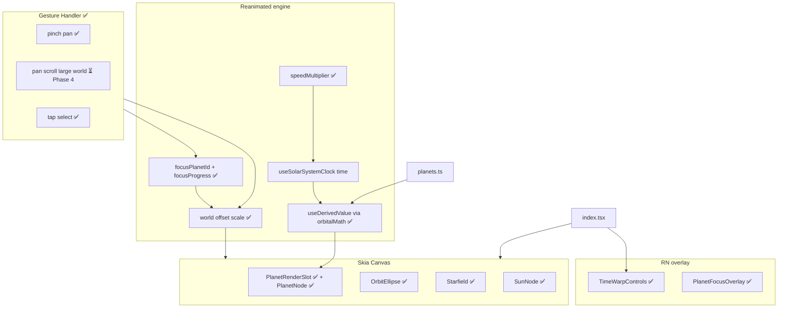
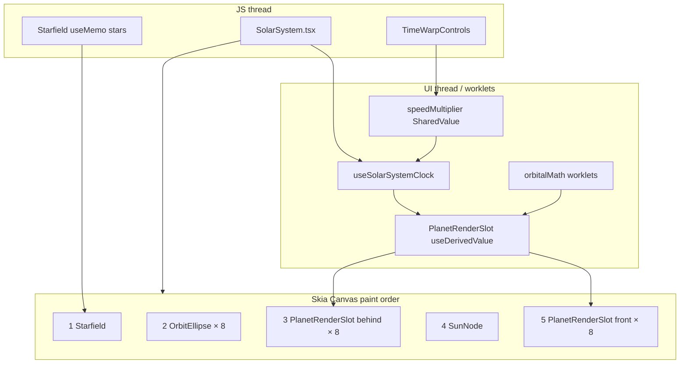
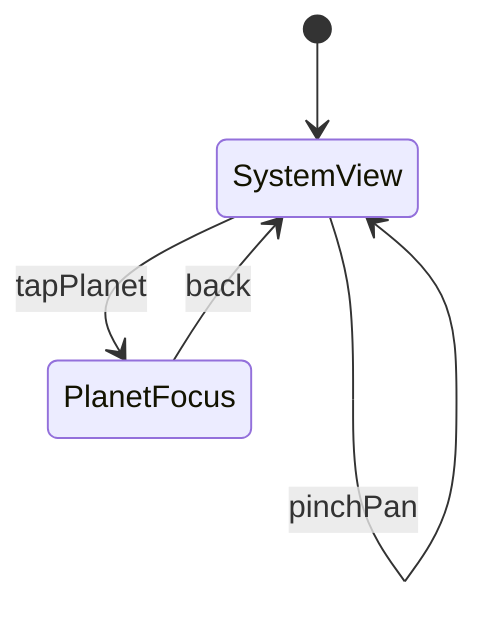

# Solar System Simulator — Plan (Skia + Reanimated)

> **Status:** In progress — **Phase 0 ✅**, **Phase 1 ✅**, **Phase 2 ✅**, **Phase 3 ✅** shipped. **Next: Phase 4 (Scale & exploration).**  
> **Stack:** Option B — 2.5D Skia + Reanimated 4, iOS dev build (`expo run:ios`).  
> **Supersedes:** The shipped 2D v1 described in [solar-system-plan.md](./solar-system-plan.md) for future work.

---

## Implementation progress

| Phase | Status | Summary |
|-------|--------|---------|
| **0 — Skia spike** | ✅ Done | `@shopify/react-native-skia@2.2.12`, `SolarSystemCanvas`, `SunNode`, Earth orbit via `useDerivedValue` + clock |
| **1 — Depth core** | ✅ Done | All 8 planets, `orbitalMath.ts`, Z parallax, z-sorted draw layers, tilted orbit ellipses, starfield, time warp 1×/10×/50× |
| **2 — Beauty** | ✅ Done | Textures + spin, glass gradients, Saturn rings, Earth/Venus atmosphere, sun corona |
| **3 — Zoom** | ✅ Done | Pinch/pan world transform, tap fly-to, `PlanetFocusOverlay`, `hitTest.ts` |
| **4 — Scale & exploration** | ⏳ Pending | Bigger planets, wider orbit spacing, scrollable large world |
| **5 — Polish** | ⏳ Pending | Delete legacy `Planet.tsx` / `Sun.tsx`, background clock pause, perf |

### Phase 0 — what shipped

- Installed `@shopify/react-native-skia` via `npx expo install` (pinned `2.2.12` in `package.json`).
- Replaced home-tab planet rendering with Skia (`SolarSystem` → `SolarSystemCanvas`); no `View` circles on the main screen.
- `SunNode.tsx`: static sun, `Circle` + `RadialGradient`.
- Earth-only spike: `useDerivedValue` for `cx`/`cy` from `useSolarSystemClock` `time` shared value.
- `app/_layout.tsx`: side-effect `import 'react-native-reanimated'` (required for Skia + Reanimated on UI thread).

### Phase 1 — what shipped

- **All 8 planets** from `SOLAR_SYSTEM_PLANETS` (`data/planets.ts`).
- **`lib/solar/orbitalMath.ts`**: 3D orbital position, perspective scale (`DEPTH_FACTOR = 0.0025`), screen projection, `computeAllPlanetScreenStates`, z-sort helper.
- **`lib/solar/starfieldData.ts`**: deterministic star positions (`mulberry32` PRNG).
- **`PlanetRenderSlot.tsx`**: depth-aware rendering (see draw order below).
- **`OrbitEllipse.tsx`**: tilted guides via Skia `Oval` + `rect()` (`rx = orbitRadius`, `ry = orbitRadius * cos(inclination)`).
- **`Starfield.tsx`**: ~180 static `Circle` stars.
- **`TimeWarpControls.tsx`**: RN overlay; `speedMultiplier` shared value (1 / 10 / 50) passed into `useSolarSystemClock`.
- **Extended `PlanetConfig`**: `name`, `orbitalPeriodDays`, `orbitInclination` (radians); kept `angularVelocity` / `spinVelocity` for motion (spin used in Phase 2+).
- **Legacy still present (do not use for home tab):** `Planet.tsx`, `Sun.tsx` — View-based; delete in Phase 5.

**Exit criteria met:** Parallax (size + Y flattening from inclination), planets pass behind/in front of sun, outer planets accelerate at 10×/50×.

### Phase 2 — what shipped

- **`assets/textures/`**: 8 stylized 64×64 PNGs (generated via `scripts/generate-planet-textures.mjs`); wired with `require()` in `data/planets.ts`.
- **`hooks/usePlanetTextures.ts`**: `useImage` preload map passed into canvas.
- **`PlanetNode.tsx`**: clipped `Image` + spin (`spinVelocity`), radial glass shading, specular highlight, Saturn ring `Path`, Earth/Venus `BlurMask` atmosphere.
- **`PlanetRenderSlot.tsx`**: slot z-sort preserved; each slot renders 8 `PlanetNode` variants with opacity gating by `planetIndex`.
- **`orbitalMath.ts`**: `PlanetScreenState` extended with `spinAngle`, `planetIndex`, `hasRings`, `hasAtmosphere`.
- **`SunNode.tsx`**: outer corona glow layers (two soft `RadialGradient` halos).
- **`planets.ts`**: `texture` on all planets; `atmosphere: true` on Earth/Venus; `rings: true` on Saturn (unchanged).

**Exit criteria met:** Distinct, polished planets—not flat color dots.

**Note:** `expo-asset` skipped (optional; `useImage(require())` works without it).

### Phase 3 — what shipped

- **`lib/solar/worldTransform.ts`**: `computeEffectiveWorldTransform` — lerps pinch/pan state toward focused planet each frame (tracks orbital motion).
- **`lib/solar/hitTest.ts`**: `hitTestPlanetAtPoint` — z-sorted tap test via same `computeAllPlanetScreenStates` as render.
- **`hooks/useEffectiveWorldTransform.ts`**: shared derived transform for canvas + slots.
- **`SolarSystem.tsx`**: `worldScale` / `worldOffsetX/Y` shared values; pinch + pan + tap gestures; `focusPlanetIndex` + `focusProgress` spring.
- **`PlanetFocusOverlay.tsx`**: planet name, orbital period, “Back to system” button.
- **`SolarSystemCanvas`**, **`PlanetRenderSlot`**, **`OrbitEllipse`**, **`SunNode`**: wired to effective world transform (starfield stays fixed).

**Exit criteria met:** Tap Mars → spring zoom/focus → overlay → back returns to system view.

### Phase 4 — Scale & exploration (planned)

The current layout was tuned so **all eight orbits fit on one phone screen** at `worldScale = 1`. Planets are small (Mercury `size: 8`, Jupiter `size: 32`) and orbit radii are tightly packed (`48` → `146` px, ~14 px steps). Phase 4 breaks that constraint: planets should read clearly at a glance, orbits should feel physically separated, and the user must **pan/scroll** to explore the full system.

**Goals**

1. **Bigger planets** — increase every `PlanetConfig.size` (diameter in px) so textures and glass shading are legible without zooming in.
2. **Wider orbit spacing** — increase `orbitRadius` per planet so adjacent orbits no longer overlap visually; **Neptune does not need to fit on screen** with the sun at default zoom.
3. **Scrollable solar system** — treat the scene as a large 2D world: pan to reach outer planets, pinch to zoom in/out; default view shows the inner system (sun + Mercury–Mars), not the entire disk.

**Current baseline → proposed targets**

| Planet | `size` today | `orbitRadius` today | `size` target (≈1.75×) | `orbitRadius` target |
|--------|-------------|---------------------|------------------------|----------------------|
| Mercury | 8 | 48 | 14 | 70 |
| Venus | 14 | 62 | 24 | 130 |
| Earth | 16 | 76 | 28 | 200 |
| Mars | 12 | 90 | 22 | 280 |
| Jupiter | 32 | 108 | 52 | 400 |
| Saturn | 28 | 122 | 48 | 520 |
| Uranus | 20 | 134 | 34 | 640 |
| Neptune | 20 | 146 | 34 | 760 |

Exact numbers are tunable during implementation; preserve **relative** size ratios (Jupiter largest, Mercury smallest) and **monotonic** orbit order. Consider a single `ORBIT_SPACING` or `ORBIT_SCALE` constant in `planets.ts` so spacing can be adjusted without editing eight rows.

**Implementation tasks**

| Task | Files | Notes |
|------|-------|-------|
| Bump planet diameters | `data/planets.ts` | Retune `focusTargetScale` in `worldTransform.ts` (`FOCUS_BASE_SCALE * (16 / planet.size)`) so fly-to still frames each planet |
| Widen orbit radii | `data/planets.ts` | Outer radius ~760 px ⇒ world extent ≈ 1500×1500 at scale 1; inner planets remain reachable by pan |
| Default zoom & scale range | `SolarSystem.tsx`, `worldTransform.ts` | Lower initial `worldScale` (e.g. `0.5–0.65`) so first frame shows sun + inner orbits; revisit `MIN_WORLD_SCALE` / `MAX_WORLD_SCALE` |
| Pan as primary navigation | `SolarSystem.tsx` | Pan gesture already exists (Phase 3); verify it stays enabled when not in planet focus; optional pan momentum (`withDecay`) for scroll feel |
| World bounds (optional) | `lib/solar/worldTransform.ts` | Soft clamp pan so user cannot scroll infinitely into empty space; bounds derived from max `orbitRadius` + planet `size` + padding |
| Starfield vs pan | `Starfield.tsx`, `SolarSystemCanvas.tsx` | **Decision:** keep starfield fixed to viewport (current) for parallax “window into space”, or translate subtly with pan — document choice in code |
| Hit-test & focus | `hitTest.ts`, `worldTransform.ts` | No formula changes; re-verify tap targets after size/radius bump |
| Orbit guides | `OrbitEllipse.tsx` | Ellipses auto-scale via `worldTransform`; no component change expected |

**Exit criteria**

- At default zoom, Mercury–Mars and the sun are visible; Jupiter+ require panning.
- Planets are visibly larger than today without pinch-zoom.
- Orbits are clearly separated (no overlapping ellipse strokes at default zoom).
- Pan + pinch navigate the full system smoothly; tap fly-to and back still work for every planet.
- No regression in z-sort, textures, or time warp.

**Out of scope for Phase 4**

- Minimap / orbit rail UI (optional Phase 5+).
- Log-scale or non-linear orbit spacing (stays linear cinematic units).

---

## Agent onboarding — read the plan + these files

A new agent should **not** need to explore the whole repo. Read this document, then open only:

| Purpose | File |
|---------|------|
| Planet data | [`data/planets.ts`](../data/planets.ts) |
| Types | [`types/planet.ts`](../types/planet.ts) |
| Orbital / projection math (worklets) | [`lib/solar/orbitalMath.ts`](../lib/solar/orbitalMath.ts) |
| Clock + time warp hook | [`hooks/useSolarSystemClock.ts`](../hooks/useSolarSystemClock.ts) |
| Screen shell + warp UI | [`components/solar-system/SolarSystem.tsx`](../components/solar-system/SolarSystem.tsx) |
| Skia scene graph + paint order | [`components/solar-system/SolarSystemCanvas.tsx`](../components/solar-system/SolarSystemCanvas.tsx) |
| Per-frame planet rendering (z-sort slots) | [`components/solar-system/PlanetRenderSlot.tsx`](../components/solar-system/PlanetRenderSlot.tsx) |
| Planet visuals (texture, glass, rings) | [`components/solar-system/PlanetNode.tsx`](../components/solar-system/PlanetNode.tsx) |
| Texture preload hook | [`hooks/usePlanetTextures.ts`](../hooks/usePlanetTextures.ts) |
| Sun draw | [`components/solar-system/SunNode.tsx`](../components/solar-system/SunNode.tsx) |
| Entry tab | [`app/(tabs)/index.tsx`](../app/(tabs)/index.tsx) |

**Phase 3 additions:** [`lib/solar/hitTest.ts`](../lib/solar/hitTest.ts), [`lib/solar/worldTransform.ts`](../lib/solar/worldTransform.ts), [`hooks/useEffectiveWorldTransform.ts`](../hooks/useEffectiveWorldTransform.ts), [`PlanetFocusOverlay.tsx`](../components/solar-system/PlanetFocusOverlay.tsx).

---

## Where you are today (post Phase 3)

| Layer | Implementation |
|-------|----------------|
| **Config** | [`data/planets.ts`](../data/planets.ts) + [`types/planet.ts`](../types/planet.ts) — 8 planets, inclinations, `daysToOmega` → `angularVelocity` |
| **Clock** | [`hooks/useSolarSystemClock.ts`](../hooks/useSolarSystemClock.ts) — `useFrameCallback`, optional `speedMultiplier` |
| **Math** | [`lib/solar/orbitalMath.ts`](../lib/solar/orbitalMath.ts) — single source for positions (render + future hit-test) |
| **Render** | Skia `Canvas` — `PlanetNode` (texture + glass + rings/atmosphere) via z-sort `PlanetRenderSlot` |
| **HUD** | [`TimeWarpControls.tsx`](../components/solar-system/TimeWarpControls.tsx) — RN overlay |
| **Gestures** | [`SolarSystem.tsx`](../components/solar-system/SolarSystem.tsx) — pinch/pan/tap; [`worldTransform.ts`](../lib/solar/worldTransform.ts), [`hitTest.ts`](../lib/solar/hitTest.ts) |
| **Scale layout** | [`data/planets.ts`](../data/planets.ts) — **tight fit today**; Phase 4 widens radii and sizes |

**Dev build:** `npx expo run:ios` (Skia native module; Expo Go may mismatch).

**Dependencies added:** `@shopify/react-native-skia@2.2.12`. Textures loaded via Skia `useImage(require())` (no `expo-asset`).

---

## Architecture

### Target (full simulator — Phases 2–5)



### As built today (Phase 1)



**Data flow**

1. `SolarSystem` creates `speedMultiplier` (`useSharedValue(1)`) and `time = useSolarSystemClock(speedMultiplier)`.
2. `SolarSystemCanvas` receives `width`, `height`, `time`; centers at `(width/2, height/2)`.
3. Each `PlanetRenderSlot` runs one `useDerivedValue` worklet: `computeAllPlanetScreenStates` → filter by `z < 0` (behind) or `z >= 0` (front) → sort by `z` ascending → pick `slotIndex` → `Circle` with `cx`/`cy`/`r`/`color`/`opacity` derived props.
4. Skia accepts Reanimated `SharedValue`s on `Circle` props directly (no `useAnimatedProps` needed for Phase 0–1).

**Canvas paint order (bottom → top)**

1. `Starfield` — static dots  
2. `OrbitEllipse` — one per planet (outer orbits first in list)  
3. **Behind sun:** 8× `PlanetRenderSlot` `layer="behind"` (only slots with a planet in `z < 0` have `opacity = 1`)  
4. `SunNode` — fixed center  
5. **In front of sun:** 8× `PlanetRenderSlot` `layer="front"` (`z >= 0`)  

Within each layer, slot `0` = farthest `z`, slot `7` = nearest — correct overlap among planets on the same side of the sun.

**Phase 3:** `worldScale`, `panX`/`panY` flow through `useEffectiveWorldTransform` (includes focus lerp). Pinch/pan/tap on a transparent gesture layer; hit-test in `hitTest.ts`.

**Phase 4 (planned):** Larger `size` / `orbitRadius` in config; lower default `worldScale`; pan becomes the primary way to reach outer planets. Optional soft pan bounds in `worldTransform.ts`.

---

## Faking 3D depth (implemented in `orbitalMath.ts`)

Angle: `θ = time * angularVelocity + initialAngle`.

**3D position** (cinematic units):

- `x = r * cos(θ)`
- `y = r * sin(θ) * cos(inclination)`
- `z = r * sin(θ) * sin(inclination)`

**Perspective** (`DEPTH_FACTOR = 0.0025`):

- `scale = 1 / (1 + z * depthFactor)`
- `screenX = centerX + (x + panX) * worldScale`
- `screenY = centerY + (y + panY) * worldScale`
- `drawRadius = (planet.size / 2) * scale * worldScale` — `size` is diameter

**Draw order:** z-sort within behind/front hemispheres via `PlanetRenderSlot` (not a single global sort across the sun).

**Orbit guides:** `OrbitEllipse` — Skia `Oval` stroke, `rgba(255,255,255,0.14)`.

---

## Data model (current)

[`types/planet.ts`](../types/planet.ts):

```typescript
export type PlanetConfig = {
  id: string;
  name: string;
  orbitalPeriodDays: number;
  orbitRadius: number;
  orbitInclination: number; // radians
  angularVelocity: number;  // derived in planets.ts via daysToOmega
  spinVelocity: number;     // reserved for Phase 2 spin visual
  size: number;             // diameter in px
  color: string;            // flat fill until textures
  initialAngle?: number;
  initialSpinAngle?: number;
  texture?: number;         // require() — Phase 2
  rings?: boolean;          // Saturn flagged true
  atmosphere?: boolean;     // Phase 2
};
```

[`data/planets.ts`](../data/planets.ts): `EARTH_OMEGA = 0.8`, `daysToOmega(days) = (EARTH_OMEGA * 365) / days`. Per-planet `orbitInclination` varies (≈0.08–0.55 rad) for visible tilt.

**Layout constants (Phase 4):** Today all orbits fit one viewport (`orbitRadius` 48–146, `size` 8–32). Phase 4 introduces wider spacing and larger bodies — see [Phase 4 — Scale & exploration](#phase-4--scale--exploration-planned).

---

## File structure

### Exists today

```
assets/textures/                         # ✅ 8 planet PNGs
types/planet.ts
data/planets.ts
hooks/usePlanetTextures.ts              # ✅
hooks/useSolarSystemClock.ts          # + speedMultiplier param ✅
lib/solar/
  orbitalMath.ts                      # ✅ + spin/rings/atmosphere state
  starfieldData.ts                    # ✅
components/solar-system/
  SolarSystem.tsx                     # shell + TimeWarpControls ✅
  SolarSystemCanvas.tsx               # Skia root ✅
  Starfield.tsx                       # ✅
  OrbitEllipse.tsx                    # ✅
  PlanetRenderSlot.tsx                # ✅ z-sort slots
  PlanetNode.tsx                      # ✅ texture + glass + rings/atmosphere
  SunNode.tsx                         # ✅ + corona
  TimeWarpControls.tsx                # ✅
  Planet.tsx                          # ⚠️ legacy View — unused on home tab
  Sun.tsx                             # ⚠️ legacy View — unused
app/(tabs)/index.tsx                  # renders SolarSystem
app/_layout.tsx                       # imports reanimated + gesture-handler
scripts/generate-planet-textures.mjs  # texture generator
```

### Phase 4 touch list

```
data/planets.ts                         # size + orbitRadius bump; optional ORBIT_SCALE constant
lib/solar/worldTransform.ts             # default scale, focus retune, optional pan bounds
components/solar-system/SolarSystem.tsx # initial worldScale, pan UX (decay, reset view)
components/solar-system/Starfield.tsx   # optional pan-linked parallax
```

---

## Reanimated + Skia patterns (established)

| Concept | Status | Where |
|---------|--------|--------|
| `useFrameCallback` | ✅ | `useSolarSystemClock` |
| `useSharedValue` | ✅ | `time`, `speedMultiplier` |
| `useDerivedValue` | ✅ | `PlanetRenderSlot` → Skia `Circle` props |
| `useAnimatedProps` | — | Not needed yet; optional for `Path` in Phase 2 |
| `withSpring` / gestures | ✅ | `SolarSystem.tsx` pinch/pan/tap + focus spring |
| Worklet math | ✅ | `lib/solar/orbitalMath.ts` (`'worklet'` on all exports used per frame) |

**Rule for next phases:** Keep heavy math in `orbitalMath.ts` worklets; reuse `computePlanetScreenState` for hit-testing (Phase 3) so tap and render stay in sync.

---

## Implementation phases

### Phase 0 — Skia spike ✅

See [Implementation progress](#implementation-progress). Exit criteria met.

### Phase 1 — Depth core ✅

See [Implementation progress](#implementation-progress). Exit criteria met.

### Phase 2 — Beauty ✅

See [Implementation progress](#implementation-progress). Exit criteria met.

### Phase 3 — Zoom + gestures ✅

See [Implementation progress](#implementation-progress). Exit criteria met.

### Phase 4 — Scale & exploration

See [Phase 4 — Scale & exploration (planned)](#phase-4--scale--exploration-planned) in Implementation progress. Summary:

1. Increase all planet `size` values (~1.5–2×).
2. Increase `orbitRadius` so orbits are clearly separated; outer system extends beyond one screen.
3. Lower default zoom; lean on existing pan gesture (+ optional bounds/momentum) to scroll the large world.

### Phase 5 — Polish

- Delete `Planet.tsx`, `Sun.tsx`.
- Pause clock on `AppState` background.
- Texture LOD / perf notes in this doc.
- Optional: minimap or “reset view” control after Phase 4 large world.

### Phase 6 — Future (optional)

- Skia RuntimeEffect glass; moons; R3F migration; Android.

---

## Zoom-to-planet (2.5D) — implemented

Pinch/pan/focus as originally designed. Hit-test must call the same `computePlanetScreenState` / `computeAllPlanetScreenStates` as `PlanetRenderSlot` at tap time.



---

## Visual direction (remaining work)

Phase 2 shipped textures, glass shading, rings, atmosphere, and sun corona. Phase 3 shipped zoom/focus. **Phase 4** shifts the layout from “compact dashboard” to **explorable map**: bigger bodies, room between orbits, scroll to discover outer planets. Phase 5+ is polish and optional navigation chrome.

---

## Risks and mitigations

- **Not true 3D** — 2.5D product; R3F remains Phase 5 escape hatch.
- **Skia + Expo 54** — `expo install` for version alignment; dev build required.
- **16 slot circles** — 8 behind + 8 front slots per frame; each active slot runs `computeAllPlanetScreenStates` once in its worklet. Phase 2 may optimize or merge into fewer draw calls.
- **Hit-test vs render** — Phase 3 must import `orbitalMath`, not duplicate formulas.
- **Legacy files** — Do not wire `Planet.tsx` back; delete in Phase 5.
- **Large world perf** — Wider orbits do not add draw calls; pan only changes transform. Watch focus spring when target planet is far from current pan offset.
- **Default view** — If initial scale is too low/high after radius bump, inner system feels wrong; tune `worldScale` default and `MIN_WORLD_SCALE` together.

---

## Out of scope for v1

True 3D / WebGL / R3F; log scale UI; Android; NASA ephemeris.

---

## Learning map

1. ~~Week 1: `useDerivedValue` → Skia~~ ✅  
2. ~~Week 2: Gradients + images = fake sphere + glass~~ ✅  
3. ~~Week 3: Gestures + world transform + focus springs~~ ✅  
4. **Week 4 (current):** Scale & exploration — bigger planets, wider orbits, scrollable world  
5. **Week 5:** Polish — legacy cleanup, clock pause, perf  
6. Later: Custom shaders; optional R3F  

---

## Changelog

| Date | Change |
|------|--------|
| 2026-05-22 | Phase 4 planned: bigger planets, wider orbit spacing, scrollable large world; Polish renumbered to Phase 5 |
| 2026-05-22 | Phase 3 shipped: pinch/pan zoom, tap hit-test, focus spring, PlanetFocusOverlay |
| 2026-05-22 | Phase 2 shipped: PlanetNode textures/spin/glass, Saturn rings, atmosphere, sun corona |
| 2026-05-22 | Phase 0 + Phase 1 shipped; plan updated with as-built architecture and agent file list |
